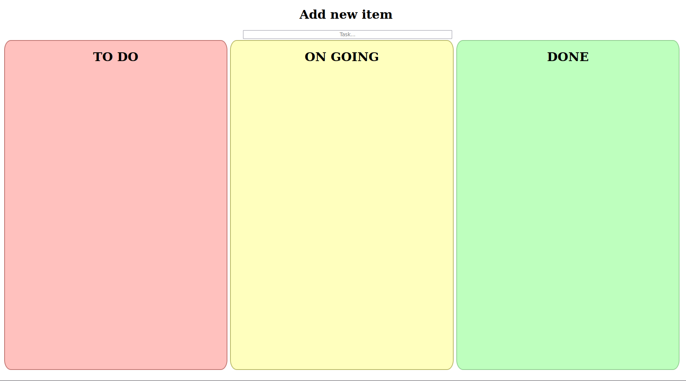

<strong>V 1.2.1 - Stuff under development</strong>

Changes:

<ul>
  <li>I am adding sorting based on the date of the task but I am having a little bit of trouble</li>
  <li>Also made the page scrollable and not fixed height because it was a stupid idea to do otherwise and yet I still did it for some reason </li>
</ul>

This project was made in HTML, CSS and JavaScript. It is a simple to do list that has the stages: to do, on going and done.

Main goals:

<ul>
<li>Add drag and drop to the tasks</li>
<li>Incorporate databases</li>
</ul>

